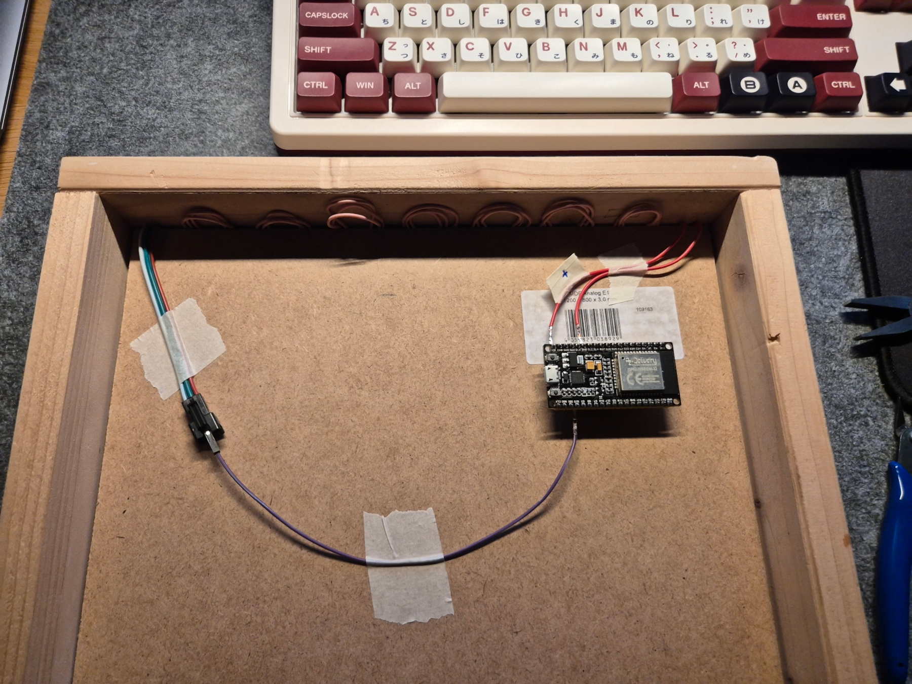
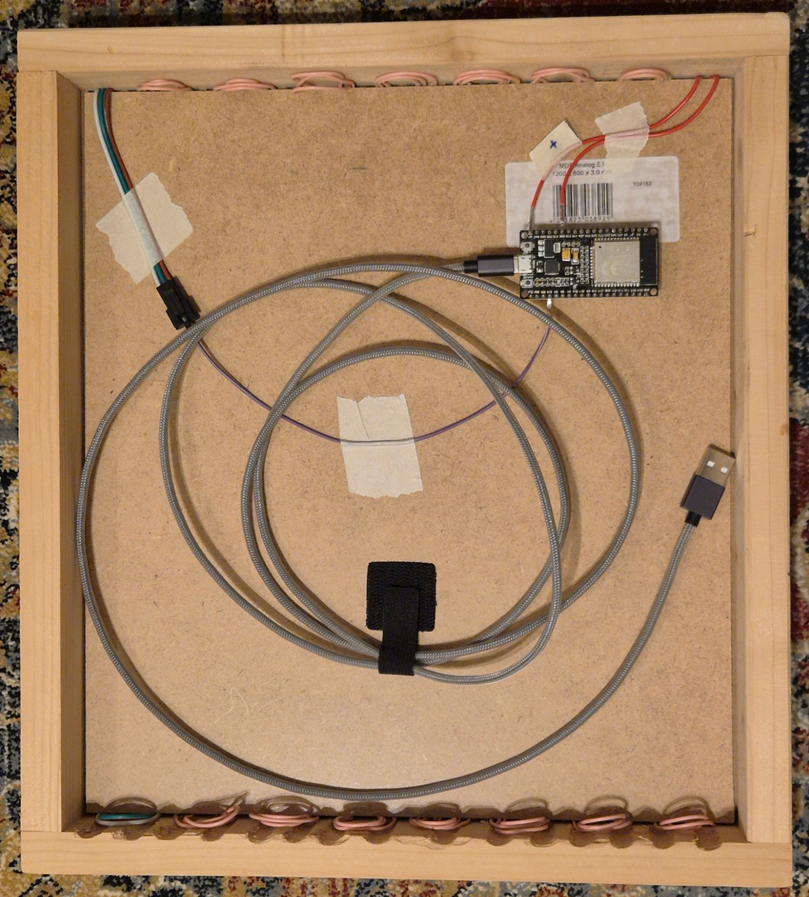
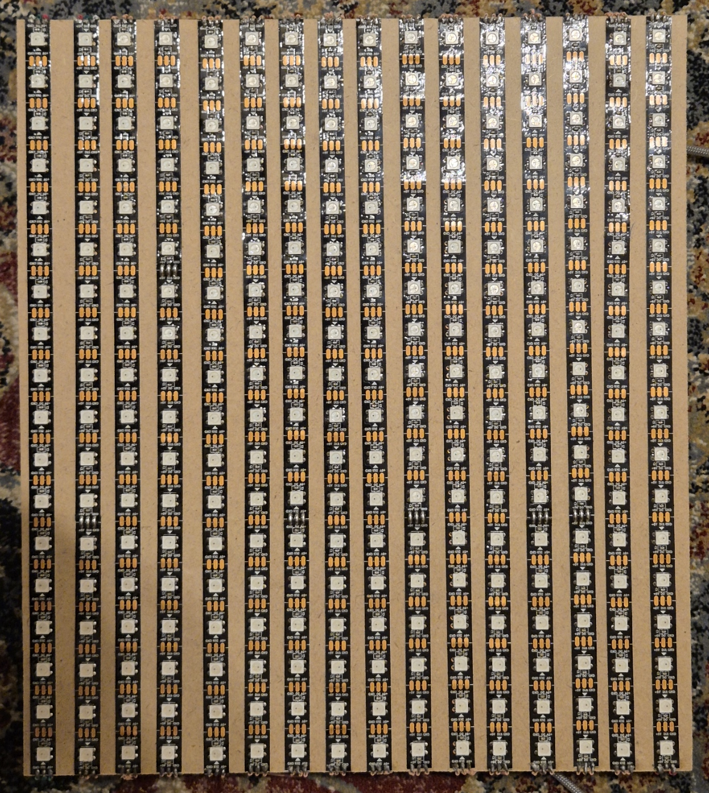
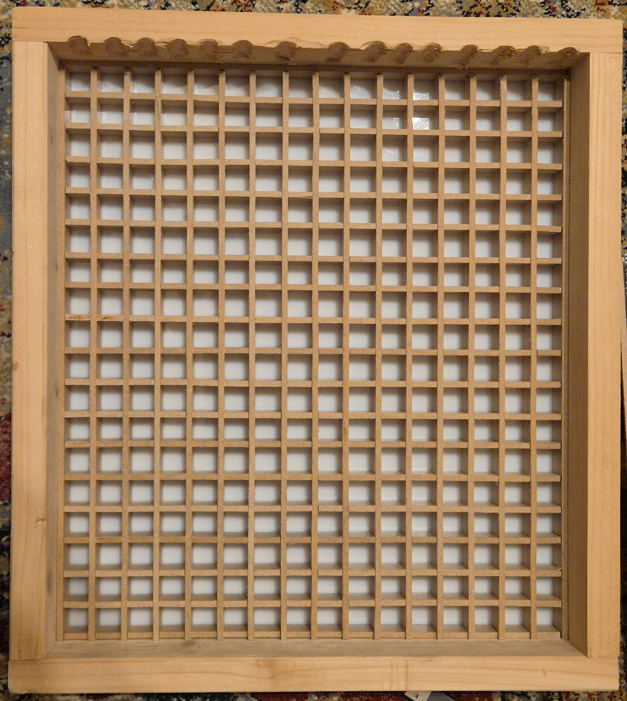

# ESP32 Pixel Display

ESP32 LED matrix weather display with temperature forecast.


## Hardware
- ESP32 Dev Board
- WS2812B LED Matrix: 18x16 (288 LEDs)
- Data Pin: GPIO 15

## Setup

1. Update WiFi credentials in `src/config.h`:
   ```cpp
   const char *ssid = "YOUR_SSID";
   const char *password = "YOUR_PASSWORD";
   ```

2. Update location in `src/config.h`:
   ```cpp
   const char *weatherURL = "...latitude=XX.XX&longitude=XX.XX...";
   ```

3. Build and upload with PlatformIO

## Bluetooth Control

Pair with **ESP32Color**:
- `b[0-100]` - Set brightness (e.g., `b50` = 50%)
- `c[0-5][RRGGBB]` - Set color (e.g., `c0FF0000` = red for temperature display)

**Color Rows:**
- 0: Top (hours/minutes)
- 1: Middle (seconds)
- 2: Bottom (day/month)
- 3: Warm temperature bars
- 4: Cold temperature bars
- 5: Time indicator dots

## Project Structure
```
src/
  ├── main.cpp    - Main implementation
  ├── main.h      - Function declarations
  └── config.h    - WiFi, colors, constants
```

## Images



